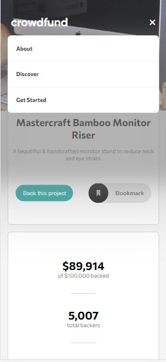
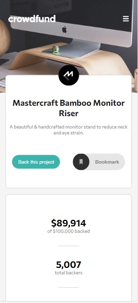
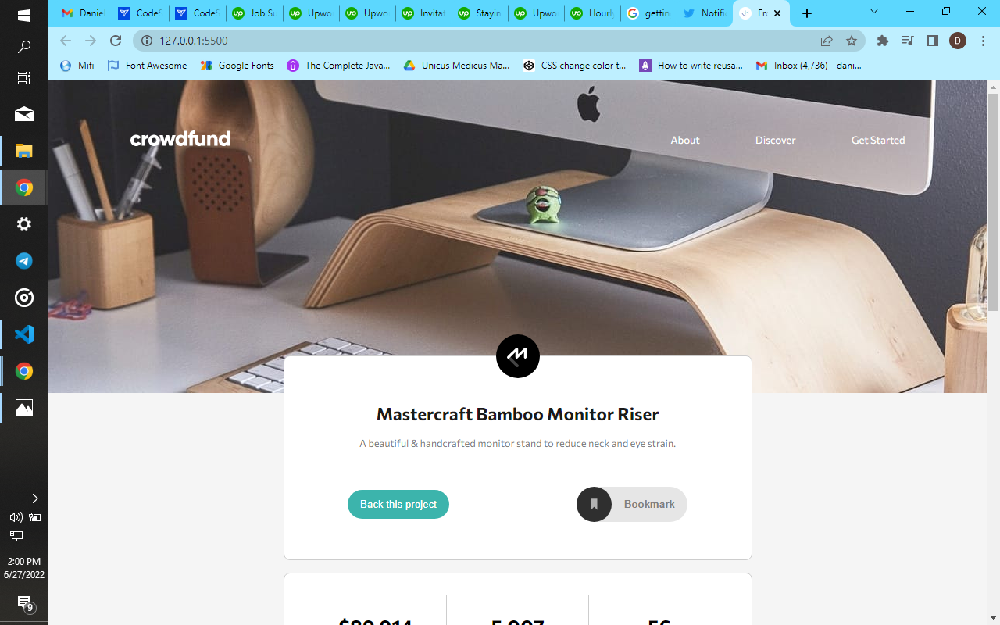
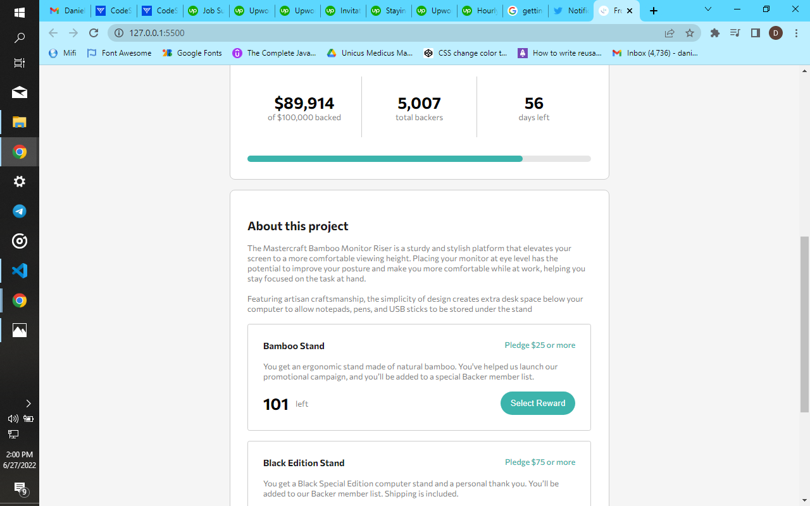

# Frontend Mentor - Crowdfunding product page solution

This is a solution to the [Crowdfunding product page challenge on Frontend Mentor](https://www.frontendmentor.io/challenges/crowdfunding-product-page-7uvcZe7ZR). Frontend Mentor challenges help you improve your coding skills by building realistic projects.

## Table of contents

- [Overview](#overview)
  - [The challenge](#the-challenge)
  - [Screenshot](#screenshot)
  - [Links](#links)
- [My process](#my-process)
  - [Built with](#built-with)
  - [What I learned](#what-i-learned)
  - [Continued development](#continued-development)
  - [Useful resources](#useful-resources)
- [Author](#author)
- [Acknowledgments](#acknowledgments)

**Note: Delete this note and update the table of contents based on what sections you keep.**

## Overview

This project is a clone of a demo crowd funding page. It was quite fun building it. I hope you enjoy as I tell you the story of how i built this.

### The challenge

Users should be able to:

- View the optimal layout depending on their device's screen size
- See hover states for interactive elements
- Make a selection of which pledge to make
- See an updated progress bar and total money raised based on their pledge total after confirming a pledge
- See the number of total backers increment by one after confirming a pledge
- Toggle whether or not the product is bookmarked

### Screenshot

### Links

- Solution URL: [https://github.com/Catalyst497/Crowd-funding-project]
- Live Site URL: [https://catalyst497.github.io/Crowd-funding-project/]

## My process

- First off, I read through the readme.md file that came with the project, to know the expectations for the project and all that.
- Checked the design folder to see what the things I was to design looked like exactly.
- Opened my index.html file to start layering out content.
  Didn't actually layer out everything all at once. Layered things part by part doing the css for each part as I went on. This is just to give myself a clearer perspective of what I was doing before moving the next part.
- As I was done with most of the HTML and CSS, I moved to the Javascript file and started the usual JS majic.
- Went back and forth between the files to produce the best looks I could from the CSS and JS.
- Oh I forgot to mention, this was my first time using SCSS for my styling. God, it was awesome. Looking forward to doing more projects with SASS/SCSS.

### Built with

- Semantic HTML5 markup
- SCSS
- Flexbox
- CSS Grid
- Mobile-first workflow

### Continued development

- SCSS
- React

## Author

- Website - [Daniel](https://www.frontendmentor.io/profile/Catalyst497)
- Frontend Mentor - [@Catalyst497](https://www.frontendmentor.io/profile/Catalyst497)
- Twitter - [@Catalyst497](https://twitter.com/Catalyst497)
- Github - [@Catalyst497](https://github.com/Catalyst497)

## Acknowledgments

Thank you so much @frontendmentor
